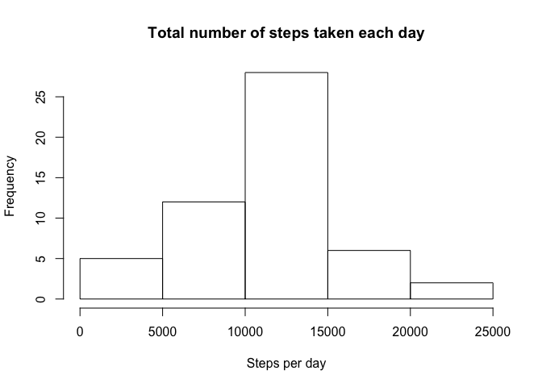
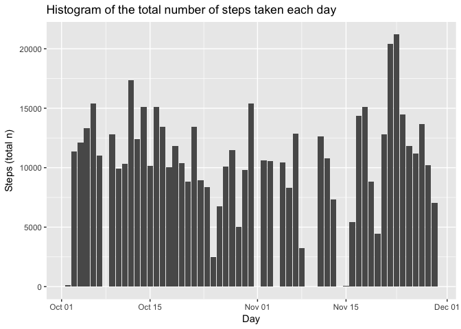
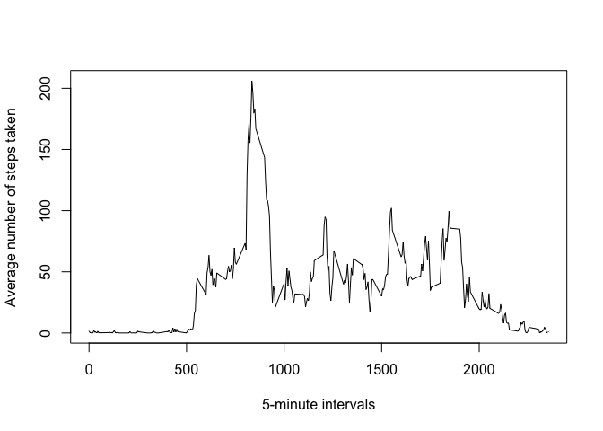
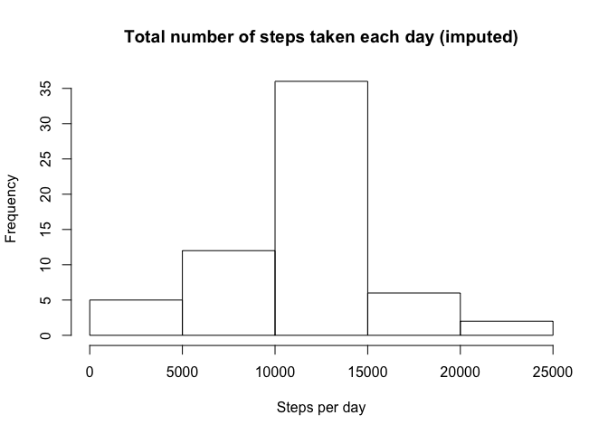
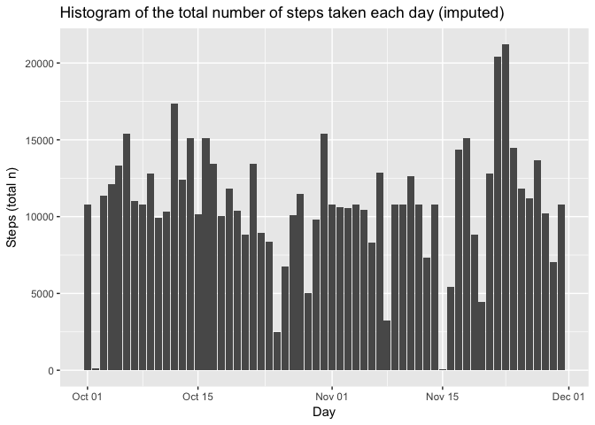
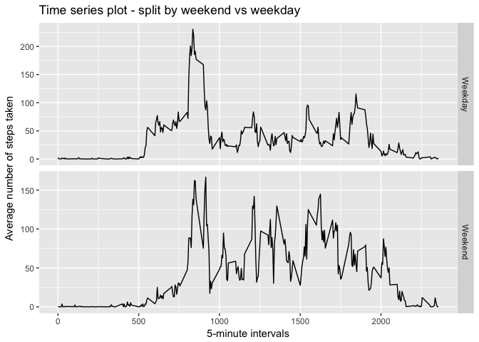

# Reproducible Research: Peer Assessment 1

```r
library(ggplot2)
library(dplyr)
```

```
## 
## Attaching package: 'dplyr'
```

```
## The following objects are masked from 'package:stats':
## 
##     filter, lag
```

```
## The following objects are masked from 'package:base':
## 
##     intersect, setdiff, setequal, union
```

```r
library(xtable)
library(mice)
knitr::opts_chunk$set(echo = TRUE)
```

## Loading and preprocessing the data

```r
activity <- read.csv("activity.csv", sep=",", na.strings="NA", header=T)
activity$date <- as.Date(activity$date, "%Y-%m-%d")
histogram <- activity[complete.cases(activity), ] # Take complete cases only
day <- group_by (histogram, date) %>% 
  summarise(sum=sum(steps), mean=mean(steps, na.rm = T), sd=sd(steps, na.rm = T), median=median(steps, na.rm = T)) # Summarise for mean and median number of steps
```


## What is mean total number of steps taken per day?

```r
hist(day$sum, xlab="Steps per day", ylab="Frequency", main="Total number of steps taken each day")
```

<!-- -->

```r
ggplot(day, aes (x=date)) +
  geom_col(aes(y=sum)) +
  scale_x_date(name="Day") +
  scale_y_continuous(name="Steps (total n)") +
  ggtitle("Histogram of the total number of steps taken each day")
```

<!-- -->

```r
stats <- xtable(summarise(activity, mean=mean(steps, na.rm=T), sd=sd(steps, na.rm = T), median=median(steps, na.rm = T)))
print(stats, type="html")
```

<!-- html table generated in R 3.3.2 by xtable 1.8-2 package -->
<!-- Wed May 24 12:03:05 2017 -->
<table border=1>
<tr> <th>  </th> <th> mean </th> <th> sd </th> <th> median </th>  </tr>
  <tr> <td align="right"> 1 </td> <td align="right"> 37.38 </td> <td align="right"> 112.00 </td> <td align="right"> 0.00 </td> </tr>
   </table>


## What is the average daily activity pattern?

```r
average <- group_by(activity, interval) %>%
  summarise(mean=mean(steps, na.rm=T))

plot(average$interval, average$mean, type="l", xlab="5-minute intervals", ylab="Average number of steps taken")
```

<!-- -->


```r
highest <- xtable(average[which.max(average$mean),])
print(highest, type="html")
```

<!-- html table generated in R 3.3.2 by xtable 1.8-2 package -->
<!-- Wed May 24 12:03:06 2017 -->
<table border=1>
<tr> <th>  </th> <th> interval </th> <th> mean </th>  </tr>
  <tr> <td align="right"> 1 </td> <td align="right"> 835 </td> <td align="right"> 206.17 </td> </tr>
   </table>
## Imputing missing values

```r
missing <- sum(is.na(activity$steps))
impute.mean <- function(x) replace(x, is.na(x), mean(x, na.rm = TRUE)) # Function for imputation
data_imputed <- as.data.frame(activity %>% group_by(interval) %>%
  mutate(steps = impute.mean(steps))) # Use dplyr to replace all NA's with the mean of the respective interval and save in dataframe data_imputed
missing_imputed <- sum(is.na(data_imputed$steps))

day_imputed <- group_by (data_imputed, date) %>% 
  summarise(sum=sum(steps), mean=mean(steps, na.rm = T), sd=sd(steps, na.rm = T), median=median(steps, na.rm = T)) # Summarise for mean and median number of steps
?as.Data
```

No documentation for 'as.Data' in specified packages and libraries:
you could try '??as.Data'

```r
hist(day_imputed$sum, xlab="Steps per day", ylab="Frequency", main="Total number of steps taken each day (imputed)")
```

<!-- -->

```r
ggplot(day_imputed, aes (x=date)) +
  geom_col(aes(y=sum)) +
  scale_x_date(name="Day") +
  scale_y_continuous(name="Steps (total n)") +
  ggtitle("Histogram of the total number of steps taken each day (imputed)")
```

<!-- -->

```r
stats2 <- xtable(summarise(data_imputed, mean=mean(steps, na.rm=T), sd=sd(steps, na.rm = T), median=median(steps, na.rm = T)))
print(stats2, type="html")
```

<!-- html table generated in R 3.3.2 by xtable 1.8-2 package -->
<!-- Wed May 24 12:03:06 2017 -->
<table border=1>
<tr> <th>  </th> <th> mean </th> <th> sd </th> <th> median </th>  </tr>
  <tr> <td align="right"> 1 </td> <td align="right"> 37.38 </td> <td align="right"> 105.32 </td> <td align="right"> 0.00 </td> </tr>
   </table>


1. The total number of missing values is 2304.
2. The total number of missing values in data_imputed  is 0.
3. The mean for the original dataset was 37.3825996 vs imputed 37.3825996.
4. The median for the original dataset was 0 vs imputed 0.
5. Mean and median obviously don't change given the choice of mean imputing based on the average per interval. Total daily number of steps will, of course, change; e.g. on 2012-10-01 (which contained several missing values) the sum is 126 in the original data, whereas 1.0766189\times 10^{4} in the imputed data.

## Are there differences in activity patterns between weekdays and weekends?

```r
data_imputed$weekend <- as.factor(ifelse(weekdays(data_imputed$date)=="Saturday" | weekdays(data_imputed$date)=="Sunday", "Weekend", "Weekday")) # Create label for weekend
average_imputed <- group_by(data_imputed, interval, weekend) %>%
  summarise(mean=mean(steps, na.rm=T))
ggplot(average_imputed, aes (x=interval)) +
  geom_line(aes(y=mean)) +
  facet_grid(weekend ~ ., scales="free_y") +
  scale_x_continuous(name="5-minute intervals") +
  scale_y_continuous(name="Average number of steps taken") +
  ggtitle("Time series plot - split by weekend vs weekday")
```

<!-- -->
